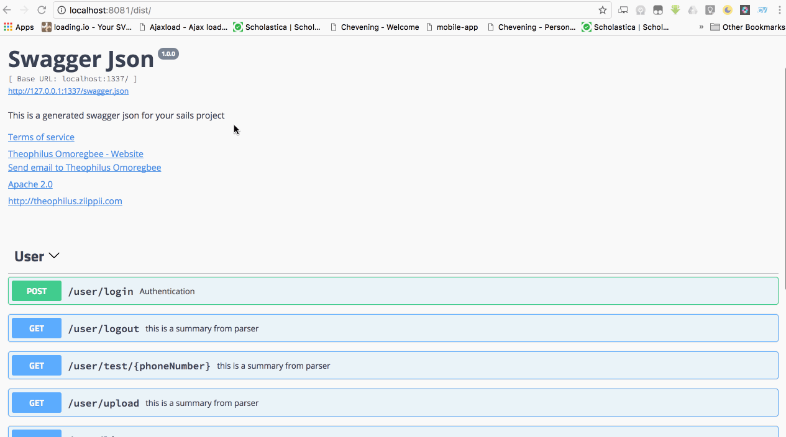

# Swagger Generator Sails Hook
[](https://travis-ci.org/theoomoregbee/sails-hook-swagger-generator)
[](https://www.npmjs.com/package/sails-hook-swagger-generator)
[]()
[]()
[](https://github.com/semantic-release/semantic-release)


This helps to create swagger documentation json which is based entirely on Swagger/OpenAPI specification (see [here](https://swagger.io/specification/)).
The hook produces specification based upon OAS 3.0.




## Installation
```sh
$ npm install sails-hook-swagger-generator --save
```


## Demo
Copy the content of [generatedSwagger](test/fixtures/generatedSwagger.json) and paste it in [Swagger Online Editor](https://editor.swagger.io/).


## Usage
Simply by lifting your sails app `sails lift`, after lifting or starting the app,there should be `swagger.json` within **./swagger** folder.

> make sure ./swagger folder is already existing.

Check the **./swagger/swagger.json** for generated swagger documentation json, then head to [Swagger Editor](https://editor.swagger.io/).

## Generated Output

By default, the Swagger Generator Sails Hook generates:
1. Full automatic documentation for all Sails Blueprint routes;
1. Documentation for all Sails
   [actions2](https://sailsjs.com/documentation/concepts/actions-and-controllers#?actions-2)
   actions with routes configured in `config/routes.js`; and
1. Listing of all routes configured in `config/routes.js` (full details cannot be inferred
   for custom routes without additional information being provided - see below).
1. Creation of default tags for paths based upon Sails Model and Controller `globalId`'s.

## Use with [Swagger UI](https://github.com/swagger-api/swagger-ui)

See [#28](https://github.com/theoomoregbee/sails-hook-swagger-generator/issues/28)

## Adding/Customising Generated Output

Documentation detail and customisation of most aspects of the generated Swagger can be achieved by adding:
1. Top-level configuration to `config/swaggergenerator.js`. This provides direct JSON
   used as the template for the output Swagger/OpenAPI.
1. Objects with the key `swagger` to custom route configuration, controller files, action
   functions, model definitions and model attribute definitions. The `swagger` element must be of type
   [SwaggerActionAttribute](./lib/interfaces.ts#L55) for actions (based on OpenApi.Operation)
   or [SwaggerModelSchemaAttribute](./lib/interfaces.ts#L66) for model schemas (based on OpenApi.UpdatedSchema).
1. JSDoc ([swagger-jsdoc](https://github.com/Surnet/swagger-jsdoc)) `@swagger` comments
   to controller/action files and model files.

Top-level Swagger/OpenAPI definitions for `tags` and `components` may be added in all `swagger` objects
above and in all JSDoc `@swagger` documentation comments. This enables the definition of top-level elements.

See below for details.

## Configurations

It comes with some default settings which can be overridden by creating `config/swaggergenerator.js`:
```javascript
module.exports['swagger-generator'] = {
    disabled: false,
    swaggerJsonPath: './swagger/swagger.json',
    swagger: {
        openapi: '3.0.0',
        info: {
            title: 'Swagger Json',
            description: 'This is a generated swagger json for your sails project',
            termsOfService: 'http://example.com/terms',
            contact: {name: 'Theophilus Omoregbee', url: 'http://github.com/theo4u', email: 'theo4u@ymail.com'},
            license: {name: 'Apache 2.0', url: 'http://www.apache.org/licenses/LICENSE-2.0.html'},
            version: '1.0.0'
        },
        servers: [
            { url: 'http://localhost:1337/' }
        ],
        externalDocs: {url: 'http://theophilus.ziippii.com'}
    },
    defaults: {
        responses: {
            '200': { description: 'The requested resource' },
            '404': { description: 'Resource not found' },
            '500': { description: 'Internal server error' }
        }
    },
    excludeDeprecatedPutBlueprintRoutes: true,
    includeRoute: function(routeInfo) { return true; },
    updateBlueprintActionTemplates: function(blueprintActionTemplates) { ... },
    postProcess: function(specifications) { ... }
};
```

Notes on the use of configuration:

* `disabled` attribute is used to disable the module (e.g you may want to disable it on production).
* `swaggerJsonPath` where to generate the `swagger.json` file to; defaults to `sails.config.appPath + '/swagger/swagger.json'`
   and output file will not be written if empty/null/undefined (see `postProcess` below for alternate save mechanism).
* `swagger` object is template for the Swagger/OpenAPI output. It defaults to the minimal content above.
   Check Swagger/OpenAPI specification for more, in case you want to extend it.
   Generally, this hook provides sensible defaults for as much as possible but you may
   override them in this location or in any of the mechanisms explained below.
* `defaults` object should contain the `responses` element; defaults to the above if not specified.
* `excludeDeprecatedPutBlueprintRoutes` should
  [deprecated](https://sailsjs.com/documentation/reference/blueprint-api/update#?notes) `PUT` blueprint
  routes be excluded from generated Swagger output; defaults to `true`.
* `includeRoute` function used to filter routes to be included in generated Swagger output; see advanced section below.
* `updateBlueprintActionTemplates` allows customisation of the templates used to generate Swagger for blueprints; see advanced section below.
* `postProcess` allows an alternate mechanism for saving and/or modification of the generated Swagger output before it is written to
   the output file; see advanced section below.


## Custom Route Configuration

Documentation detail and customisation of most aspects of the generated Swagger for
[custom routes](https://sailsjs.com/documentation/concepts/routes/custom-routes) may be achieved by:

1. Adding an object with the key `swagger` (must be of type [SwaggerActionAttribute](./lib/interfaces.ts#L55) for actions, based on OpenApi.Operation) to individual route configurations in `config/routes.js`.
1. Adding an object with the key `swagger` (must be of type [SwaggerControllerAttribute](./lib/interfaces.ts#L76)) to the exports of a controller file, standalone action file or actions2 file.
1. Adding an object with the key `swagger` (must be of type [SwaggerModelAttribute](./lib/interfaces.ts#L87)) to the exports of a model file.
1. Adding JSDoc `@swagger` comments to Sails
  [model files](https://sailsjs.com/documentation/concepts/models-and-orm/models),
  [controller files](https://sailsjs.com/documentation/concepts/actions-and-controllers#?controllers),
  [standalone action files](https://sailsjs.com/documentation/concepts/actions-and-controllers#?standalone-actions) or
  [actions2 files](https://sailsjs.com/documentation/concepts/actions-and-controllers#?actions-2); specifically:
    - JSDoc `@swagger` documentation under the `/{actionName}` path for the route (controllers/actions), or
    - JSDoc `@swagger` documentation under the `/{blueprintAction}` path for the route (models), or
    - JSDoc `@swagger` documentation under `tags` and `components` paths for adding to the top-level Swagger/OpenAPI definitions.


### Custom Route Configuration in `config/routes.js`

If you want to add extra configuration to a route, it can be done via the `config/routes.js`, since Sails uses different [route targets](https://sailsjs.com/documentation/concepts/routes/custom-routes#?route-target), we can leverage the route object target to extend/override our swagger configuration by adding an object with a key `swagger`.

For example, in `config/routes.js`:
```javascript
{
  'post /user/login': {
    controller: 'UserController',
    action: 'login',
    swagger: {
      summary: 'Authentication',
      description: 'This is for authentication of any user',
      tags: [ 'Tag Name' ],
      requestBody: {
        content: {
          'application/json': {
            schema: {
              properties: {
                email: { type: 'string' },
                password: { type: 'string', format: 'password' }
              },
              required: [ 'email', 'password' ],
            }
          }
        }
      },
      parameters: [{
        in: 'query',
        name: 'firstName',
        required: true,
        schema: { type: 'string' },
        description: 'This is a custom required parameter'
      }],
      responses: {
        '200': {
          description: 'The requested resource',
            content: {
              'application/json': {
                schema: {
                  type: 'array',
                  items: { '$ref': '#/components/schemas/someDataType' },
                },
              },
            },
        },
        '404': { description: 'Resource not found' },
        '500': { description: 'Internal server error' }
      }
    }
  }
}
```

### Custom Route Configuration in Controller or Action files

Documentation detail and customisation of most aspects of the generated Swagger may be added to
[controller files](https://sailsjs.com/documentation/concepts/actions-and-controllers#?controllers),
[standalone action files](https://sailsjs.com/documentation/concepts/actions-and-controllers#?standalone-actions) or
[actions2 files](https://sailsjs.com/documentation/concepts/actions-and-controllers#?actions-2) as follows:

1. Adding an object with the key `swagger` added to a controller file action function.
1. Adding an object with the key `swagger` to the exports of a controller file, standalone
   action file or actions2 file:
   - For controller files, actions are referenced by adding objects keyed on `swagger.actions.{actionName}`
     name. See [UserController.js](./api/controllers/UserController.js);
   - For standalone action or actions2 files, placing content in the
     `swagger.actions.{actionFileName|actions2FileName}` object. See
     [actions2.js](./api/controllers/subdir/actions2.js)
     ***Note**: `actionFileName|actions2FileName` must correspond to the filename*;
   - For all controller/action files, adding per-action documentation to be
     applied to **all** actions using the key `swagger.actions.allActions`
     e.g. use this to apply common tags to all actions for a controller.
   - Adding documentation under `tags` and `components` elements for adding to the
     top-level Swagger/OpenAPI definitions. See example in either
     [UserController.js](./api/controllers/UserController.js)
     or [actions2.js](./api/controllers/subdir/actions2.js).
1. Adding JSDoc `@swagger` comments to controller file, standalone action file or actions2 file:
   - JSDoc `@swagger` documentation under the `/{actionName}` path for the controller file actions,
   - JSDoc `@swagger` documentation under the `/{actionFileName|actions2FileName}` path for standalone action or actions2 files,
   - JSDoc `@swagger` documentation under the `/allActions` path to be applied to **all** actions for the controller, or
   - JSDoc `@swagger` documentation under `tags` and `components` paths for adding to the top-level Swagger/OpenAPI definitions.

An `exclude` property, set to `true`, may be added to any `swagger` element or `@swagger` JSDoc
action documentation to exclude that action from the generated Swagger. See example in
[NomodelController.js](api/controllers/NomodelController.js).

The Swagger definition for each action is merged in the order above to form the final
definition, with `config/routes.js` taking highest precendence and **earlier** definitions
above taking precedence over later.

#### For actions2 files:
1. Inputs are parsed to generate parameter documentation.
2. Exits are parsed to generate response documentation.
3. Both may be customised/overridden by specifying parameters and/or responses in the `swagger` object
   in actions2 file.
4. Inputs may also add an object with the key `meta.swagger` to document the attributes
   Swagger/OpenAPI **schema** associated with the input value. See example in
   [actions2.js](./api/controllers/subdir/actions2.js).
5. Inputs may be excluded from the generated Swagger by setting `meta.swagger.exclude` to `true`.
6. Inputs may specify *where* the input should be included within the generated Swagger using the key
   `meta.swagger.in`. The values `query`/`header`/`path`/`cookie` may be used to produce Swagger operation
   parameters and the value `body` may be used to produce `requestBody` schema properties
   (valid for PUT/POST/PATCH operations only).

For example, for a route configured as:
```javascript
module.exports.routes = {
    '/api/v1/auth/tokens': 'AuthController.tokens',
};
```

The `tokens` action might be documented in a Controller `api/controllers/AuthController.js` as follows:
```javascript
function tokens(req, res) {
    ...
}

module.exports = {
    tokens: tokens,
    swagger: {
      actions: {
        tokens: {
            tags: [ 'Auth' ],
            description: 'Route description...'
        }
      }
      tags: [
             {
                name: 'Auth',
                description: 'Module description ...',
             }
        ],
      components: {
        ...
      }
    }
};
```

Or, alternately using JSDoc:
```javascript
/**
 * @swagger
 *
 * /tokens:
 *   description: Route description...
 *   tags:
 *     - Auth
 * tags:
 *   - name: Auth
 *     description: Module description...
 */
function tokens(req, res) {
    ...
}

module.exports = {
    tokens: tokens
};
```

## Blueprint Route Configuration

Documentation detail and customisation of most aspects of the generated Swagger for
[blueprint routes](https://sailsjs.com/documentation/concepts/blueprints/blueprint-routes) may be achieved by:

1. Adding an object with the key `swagger` to individual models e.g. `api/models/modelName.js`:
   - Adding documentation to the model's Swagger **schema** using the key `swagger.modelSchema`
     e.g. use this to apply detailed documentation via the `description` field;
   - In additon to the model's schema, the key `swagger.modelSchema` may be used to specify
     tag names (as a `string[]`) to be assigned all blueprint actions for the model.
     This is a *non-standard* convenience function i.e. in Swagger/OpenAPI you need to
     explicitly add tags to **each/every** OpenAPI.Operation;
   - Adding per-action documentation by adding objects keyed on
     `swagger.actions.{blueprintAction}` name;
   - Adding action documentation to **all** actions using the key `swagger.actions.allActions`
     e.g. use this to apply common `externalDocs` to all blueprint actions for the model; or
   - Adding documentation under `swagger.tags` and `swagger.components` elements for adding to the top-level Swagger/OpenAPI definitions.
1. Adding documentation-specific fields to model attributes (supports `description`, `moreInfoUrl` and `example`).
   Note that applicable Sails [attributes](https://sailsjs.com/documentation/concepts/models-and-orm/attributes),
   [automigrations](https://sailsjs.com/documentation/concepts/models-and-orm/attributes#?automigrations) and
   [validations](https://sailsjs.com/documentation/concepts/models-and-orm/validations) are also parsed.
1. Adding an object with the key `meta.swagger` to individual model attributes to document
   the attributes Swagger/OpenAPI **schema**. See example in [Pet.js](./api/models/Pet.js).
1. Adding JSDoc `@swagger` comments to model files:
   - JSDoc `@swagger` documentation under the `/{globalId}` to add documentation to
     the model's Swagger **schema** (or tags as noted above),
   - JSDoc `@swagger` documentation under the `/{blueprintAction}` to add per-action
     documentation for the
     [model blueprint actions](https://sailsjs.com/documentation/concepts/blueprints/blueprint-actions),
   - JSDoc `@swagger` documentation under the `/allActions` path to be applied to **all**
     blueprint actions for the model, or
   - JSDoc `@swagger` documentation under `tags` and `components` paths for adding to the
     top-level Swagger/OpenAPI definitions.

An `exclude` property, set to `true`, may be added to any `swagger` element of `@swagger` JSDoc
action documentation to exclude the model *completely* (exclude the **schema**) or a specific
blueprint action from the generated Swagger. See example in [OldPet.js](api/models/OldPet.js).

Individual model attributes may be excluded from the generated Swagger by setting
`meta.swagger.exclude` to `true`. See example in [Pet.js](api/models/Pet.js).

OpenAPI 3 specifies the ***Any Type*** by the absence of the `type` property in a schema;
this may be achieved by setting a model attribute's `meta.swagger.type` value to `null`.
See example in [User.js](api/models/User.js).

The Swagger definition for each action is merged in the order above to form the final
definition, with `config/routes.js` taking highest precendence and **earlier** definitions
above taking precedence over later.

For example, in a model `api/models/User.js`:

```javascript
/**
 * @swagger
 *
 * /User:
 *   tags:
 *     - Tag Name
 * /findone:
 *   externalDocs:
 *     url: https://docs.com/here
 */
module.exports = {
  attributes: {
    uid: {
      type: 'string',
      example: '012345',
      description: 'A unique identifier',
    }
  },
  swagger: {
    actions: {
      create: { ... },
    },
    modelSchema: { ... },
    tags: [...]
    components: {...}
  }
};
```

Note that following parameters are added to the `components/parameters` if they are not
provided in `config/swaggergenerator.js` (expressed as OpenAPI references):

```javascript
[
  { $ref: '#/components/parameters/WhereQueryParam' },
  { $ref: '#/components/parameters/LimitQueryParam' },
  { $ref: '#/components/parameters/SkipQueryParam' },
  { $ref: '#/components/parameters/SortQueryParam' },
  { $ref: '#/components/parameters/SelectQueryParam' },
  { $ref: '#/components/parameters/PopulateQueryParam' },
]
```

Note that when generating Swagger/OpenAPI documentation for blueprint routes, the hook also
generates:

1. Schemas for **models**, which may be referenced using the form `{ $ref: '#/components/schemas/modelName' }`.
2. Parameters for model **primary keys**, which may be referenced using the form `{ $ref: '#/components/parameters/ModelPKParam-modelName' }`.

These may be re-used (referenced) if/as applicable within custom route documentation.


## Handling Top-Level Swagger Defintions (Tags and Components)

You are able to add to the top-level Swagger/OpenAPI definitions for `tags` and `components` in all `swagger` objects
detailed above and in all JSDoc `@swagger` documention comments.

All `swagger` objects may contain the elements `tags` and `components`(*except the ones specified in `config.routes.js*) e.g.

```javascript
{
  tags: [
    {
      name: 'Test Module',
      description: 'Module description ...',
      externalDocs: { url: 'https://docs.com/test' }
    }
  ],
  components: {
    schemas: {
      test: { ... }
    }
  }
}
```

Similarly, JSDoc `@swagger` tags may define `tags` and `components`:

```javascript
/**
 * @swagger
 *
 * tags:
 *   - name: Test Module
 *     description: |
 *       Module description
 *       (continued).
 *
 *       Another paragraph.
 *
 *     externalDocs:
 *       url: https://docs.com/test
 *       description: Refer to these docs
 *
 * components:
 *   schemas:
 *     test:
 *       ...
 */
```

### Tags Handling

Tags are added to the top-level Swagger/OpenAPI definitions as follows:
1. If a tags with the specified name **does not** exist, it is added.
1. Where a tag with the specified name **does** exist, elements _of that tag_ that do not exist are added
   e.g. `description` and `externalDocs` elements.

Note that a final *clean-up* phase is run after processing, which performs the following:
1. Removal of unreferenced tags; and
2. Creation of tags referenced but are not defined.

### Component Element Handling

Elements of components are added to the top-level Swagger/OpenAPI definitions as follows:
1. Elements of the component definition reference (schemas, parameters, etc) are added where
   they **do not exist**.
1. Existing elements are **not** overwritten or merged.

For example, the element `components.schemas.pet` will be added as part of a merge process,
but the contents of multiple definitions of `pet` **will not** be merged.

The following elements (from the OpenAPI 3 specification) are handled:
```javascript
let componentDefinitionReference = {
    // Reusable schemas (data models)
    schemas: {},
    // Reusable path, query, header and cookie parameters
    parameters: {},
    // Security scheme definitions (see Authentication)
    securitySchemes: {},
    // Reusable request bodies
    requestBodies: {},
    // Reusable responses, such as 401 Unauthorized or 400 Bad Request
    responses: {},
    // Reusable response headers
    headers: {},
    // Reusable examples
    examples: {},
    // Reusable links
    links: {},
    // Reusable callbacks
    callbacks: {},
};
```


## Advanced Filtering/Processing of Generated Swagger

Three mechanisms are provided to enable advancing filtering of the Swagger generation process:
1. An `includeRoute()` function used to filter routes to be included in generated Swagger output.
1. An `updateBlueprintActionTemplates()` function allows customisation of the templates used to generate Swagger for blueprints.
1. A `postProcess()` function allows an alternate mechanism for saving and/or modification of the generated Swagger output before it is written to the output file.

Each is configured in `config/swaggergenerator.js`.

### Route Information

This hook parses all routes, custom and blueprint, before commencing the generation of the Swagger output.
Each route is described by a `SwaggerRouteInfo` object
(see defintion [here](./lib/interfaces.ts#L184)):

```typescript
export interface SwaggerRouteInfo {
  middlewareType: MiddlewareType; //< one of action|blueprint

  verb: HTTPMethodVerb; //< one of all|get|post|put|patch|delete
  path: string; //< full Sails URL as per sails.getUrlFor() including prefix
  variables: string[]; //< list of ALL variables extracted from path e.g. `/pet/:id` --> `id`
  optionalVariables: string[]; //< list of optional variables from path e.g. `/pet/:id?`

  action: string; //< either blueprint action (e.g. 'find') or action identity (e.g. 'subdir/reporting/run')
  actionType: ActionType; //< one of blueprint|shortcutBlueprint|controller|standalone|actions2|function
  actions2Machine?: Sails.Actions2Machine; //< for actionType === 'actions2', details of the action2 machine

  model?: SwaggerSailsModel; //< reference to Sails Model (blueprints only)
  associationAliases?: string[]; //< association attribute names (relevant blueprint routes only)

  defaultTagName?: string; //< default tag name for route, if any, based on Sails Model or Controller

  swagger?: SwaggerActionAttribute; //< per-route Swagger (OpenApi Operation)
}
```

Other interfaces for models, `swagger` elements etc may be found in [interfaces.ts](./lib/interfaces.ts).


### Route Filtering

The `includeRoute(routeInfo): boolean` function may be used to select which routes are included in the generated Swagger output.

For example:
```javascript
module.exports['swagger-generator'] = {
  includeRoute: (routeInfo) => {
    let c = routeInfo.controller;
    if(!c) return true;
    if(c.toLowerCase().startsWith('user')) return true;
    return false;
  }
}
```

### Customising Blueprint Action Templates

The templates used for generating Swagger for each Sails blueprint action route may be
customised / modified / added to using the `updateBlueprintActionTemplates` config option
e.g. to support custom blueprint actions/routes.

For example:
```javascript
module.exports['swagger-generator'] = {
  updateBlueprintActionTemplates: function(blueprintActionTemplates) {
    blueprintActionTemplates.search = { ... };
    return blueprintActionTemplates;
  }
}
```

The `blueprintActionTemplates` object contains keys of the blueprint **action names**
and values as per the following example (refer to the
[source code](lib/type-formatter.js#L70) for the default templates):

```javascript
let blueprintActionTemplates = {
  findone: {
    summary: 'Get {globalId} (find one)',
    description: 'Look up the **{globalId}** record with the specified ID.',
    externalDocs: {
      url: 'https://sailsjs.com/documentation/reference/blueprint-api/find-one',
      description: 'See https://sailsjs.com/documentation/reference/blueprint-api/find-one'
    },
    parameters: [
      'primaryKeyPathParameter', // special case; filtered and substituted during generation phase
      { $ref: '#/components/parameters/LimitQueryParam' },
    ],
    resultDescription: 'Responds with a single **{globalId}** record as a JSON dictionary',
    notFoundDescription: 'Response denoting **{globalId}** record with specified ID **NOT** found',
    // if functions, each called with (blueprintActionTemplate, routeInfo, pathEntry)
    modifiers: ['addSelectQueryParam', exampleModifierFunctionRef],
  },
  ...
};
```

Note that:
1. For summary and description strings the value `{globalId}` is replaced with the applicable Sails model value.
1. Parameters values are Swagger definitions, with the exception of the *special* string value
   `primaryKeyPathParameter`, which may be used to include a reference to a model's primary key.
1. Modifiers are used to apply custom changes to the generated Swagger, noting that:
   - String values are predefined in `generatePaths()` (refer to the [source code](lib/generators.js#L246));
     valid  modifiers are:
     - `addPopulateQueryParam`
     - `addSelectQueryParam`
     - `addOmitQueryParam`
     - `addModelBodyParam`
     - `addModelBodyParamUpdate`
     - `addResultOfArrayOfModels`
     - `addAssociationPathParam`
     - `addAssociationFKPathParam`
     - `addAssociationResultOfArray`
     - `addResultOfModel`
     - `addResultNotFound`
     - `addResultValidationError`
     - `addFksBodyParam`
     - `addShortCutBlueprintRouteNote`
   - Functions are called as `func(blueprintActionTemplate, routeInfo, pathEntry, tags, components)`
     where
     - `blueprintActionTemplate` the blueprint action template (see above) to which the modifier relates
     - `routeInfo` the route information object (see above) for which the Swagger is being generated
     - `pathEntry` the generated Swagger path entry to be modified
     - `tags` the generated Swagger **tag** definitions to be modified/extended
     - `components` the generated Swagger **component** definitions to be modified/extended

### Post-processing Generated Swagger Output

The final generated Swagger output may be post-processed before it is written to
the output file using a post-processing function specified as the `postProcess` config option.

For situations where saving the generated swagger documentation JSON to a file is
not desired/appropriate, the `postProcess` config option may be used to specify
an alternate save mechanism.

Note that if `swaggerJsonPath` config option is empty/null/undefined the output file will not be written.

For example:
```javascript
module.exports['swagger-generator'] = {
  postProcess: function(specifications) {
    let sch = specifications.components.schemas;
    Object.keys(sch).map(k => {
      sch[k].description = sck[k].description.toUpperCase();
    });
  }
}
```


## Testing

* Clone this repository

* Install all development dependencies

```sh
 npm install
```
* Then run test

```sh
npm test
```

## Contribute

Fork this repo and push in your ideas.
Do not forget to add a bit of test(s) of what value you adding.
* stick to conventional commit message [here](https://conventionalcommits.org/) or read more [angular commit](https://github.com/angular/angular/blob/master/CONTRIBUTING.md#commit) pattern
* While developing, you can run the below command to start nodemon watch too run linting and testing on `.ts` changes

```sh
npm run dev
```

## Changelog

See the different releases [here](https://github.com/theo4u/sails-hook-swagger-generator/releases)

## License

MIT License (MIT)
